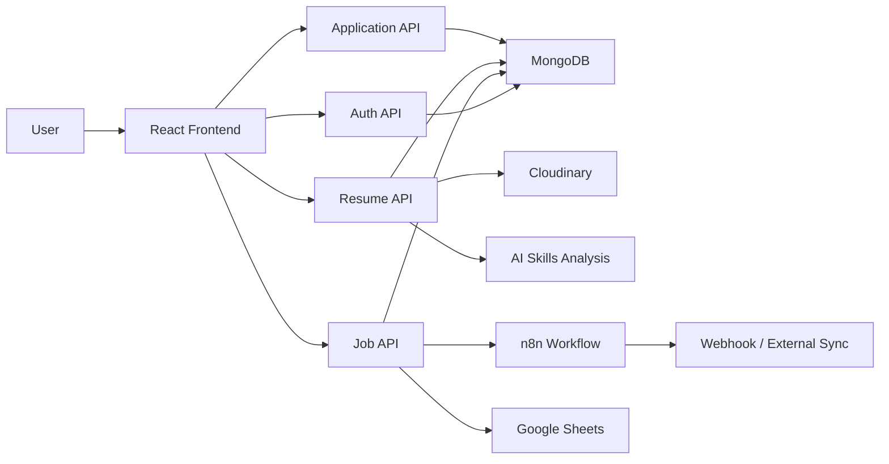

# AI Job Search Platform

The AI Job Search Platform is a full-stack application designed to help users discover jobs, manage applications, upload resumes, and receive AI-powered insights that improve their job search experience. The system combines a modern React frontend, a Node.js/Express backend, MongoDB persistence, and workflow automation with n8n to create a smart and connected job application experience.

## 1. Project Overview

This repository is divided into three main parts:

- Frontend: a React + Vite application for the user interface
- Backend: an Express-based API for authentication, job workflows, resumes, and AI services
- n8n: automation workflows for syncing and external processing tasks

The goal of the platform is to make job hunting easier by combining application tracking, resume intelligence, and automation in one place.

## 2. What This Platform Does

Users can:

- Create an account and log in securely
- Browse and search jobs
- Track applications in a structured dashboard
- Upload resumes for storage and analysis
- Receive AI-driven suggestions about skills and resume improvements
- Manage their profile and application progress
- Use automated workflows for job-related processes

## 3. Core Features

### User Experience Features

- Secure login and registration flow
- Protected routes for authenticated users
- Dashboard for application tracking
- Profile management screen
- Resume upload section
- Job browsing and search experience
- Application status cards and progress visualization

### Backend Capabilities

- RESTful API endpoints for authentication, users, resumes, jobs, and applications
- JWT-based authentication and authorization
- MongoDB storage through Mongoose models
- Resume upload handling with Cloudinary integration
- AI-based skills analysis and resume intelligence services
- Google Sheets integration for external data synchronization
- Webhook support for automation and external system communication

### Automation Features

- Workflow automation using n8n
- Webhook-triggered processing for job sync and external tasks
- Flexible integration layer for future automation expansion

## 4. Technology Stack

### Frontend

- React 19
- Vite
- Redux Toolkit
- React Router
- Tailwind CSS
- ESLint

### Backend

- Node.js
- Express.js
- MongoDB + Mongoose
- JWT
- Cloudinary
- Multer
- Google Gemini AI integration
- Google APIs
- Axios
- dotenv

### Automation

- n8n
- Docker Compose
- SQLite-based n8n data storage

## 5. Project Structure

```text
ai-job-search/
├── backend/
│   ├── src/
│   │   ├── app.js
│   │   ├── server.js
│   │   ├── controllers/
│   │   ├── middlewares/
│   │   ├── models/
│   │   ├── routes/
│   │   └── services/
│   ├── package.json
│   └── service-account.json
├── frontend/
│   ├── src/
│   │   ├── components/
│   │   ├── pages/
│   │   ├── redux/
│   │   ├── services/
│   │   └── App.jsx
│   ├── package.json
│   └── vite.config.js
└── n8n/
    ├── docker-compose.yml
    ├── My workflow.json
    └── n8n_data/
```

## 6. System Flow Diagram

The following diagram explains how the platform works from a user action to data processing and storage.



## 7. How the Application Works

1. A user opens the frontend and signs in or registers.
2. The frontend sends requests to the backend APIs for jobs, applications, and resumes.
3. The backend validates authentication and stores or retrieves data from MongoDB.
4. Resume uploads are processed and sent to Cloudinary for storage.
5. AI services analyze the resume and extract useful skill-related insights.
6. n8n workflows can trigger external automation tasks such as job syncing or webhook actions.
7. Users see the updated dashboard and application progress in real time.

## 8. Prerequisites

Before running this project locally, make sure you have:

- Node.js installed
- npm installed
- MongoDB running or accessible
- Cloudinary account credentials
- A valid Google AI or related service configuration if AI features are enabled

## 9. Setup Instructions

### Step 1: Clone the repository

```bash
git clone <your-repository-url>
cd AI-Job-Search
```

### Step 2: Install backend dependencies

```bash
cd backend
npm install
```

### Step 3: Install frontend dependencies

```bash
cd ../frontend
npm install
```

### Step 4: Configure environment variables

Create a `.env` file in the backend directory with values similar to the following:

```env
PORT=8000
MONGODB_URI=your_mongodb_connection_string
JWT_SECRET=your_secret_key
FRONTEND_URL=http://localhost:5173
CLOUDINARY_CLOUD_NAME=your_cloud_name
CLOUDINARY_API_KEY=your_api_key
CLOUDINARY_API_SECRET=your_api_secret
N8N_WEBHOOK_URL=your_webhook_url
```

### Step 5: Start the backend

```bash
cd backend
npm run dev
```

### Step 6: Start the frontend

```bash
cd frontend
npm run dev
```

The frontend will usually run at:

```text
http://localhost:5173
```

The backend API will typically run at:

```text
http://localhost:8000
```

## 10. Available Scripts

### Backend Scripts

- `npm run dev` — start the backend in development mode using nodemon
- `npm start` — start the backend in production mode

### Frontend Scripts

- `npm run dev` — start the Vite development server
- `npm run build` — create a production build
- `npm run preview` — preview the production build locally
- `npm run lint` — run ESLint checks

## 11. API Areas

The backend exposes major modules for:

- Authentication: `/api/auth`
- User management: `/api/user`
- Resume handling: `/api/resume`
- Jobs and applications: `/api/job` and `/api/application`
- Webhook and automation: `/api/webhook`

## 12. Future Goals

The platform has strong potential for continued growth. Some planned improvements include:

- AI-powered job matching based on user profile and skills
- Personalized job recommendations and ranking
- Interview preparation support with AI-generated questions and answers
- Resume improvement suggestions with score-based feedback
- Notification system for application deadlines and interview updates
- Admin dashboard for monitoring user activity and platform performance
- Advanced analytics for job search trends and success rates
- Deployment to cloud platforms with better scalability and monitoring
- Mobile-friendly enhancements and native app support

## 13. Development Notes

- The frontend and backend are intentionally separated for easier scaling and maintenance.
- The backend can be extended with more AI modules as the platform grows.
- n8n workflows make it easier to connect the platform with third-party systems and automation tools.
- This project is a strong foundation for building a smart, AI-assisted career platform.

## 14. Contribution

Contributions are welcome. If you want to improve the project:

1. Fork the repository
2. Create a feature branch
3. Make your changes
4. Open a pull request with a clear explanation

## 15. Summary

This project is more than a simple job board. It combines job discovery, career management, file handling, AI analysis, and workflow automation into one unified experience. Its modular structure makes it easy to extend and improve over time.
