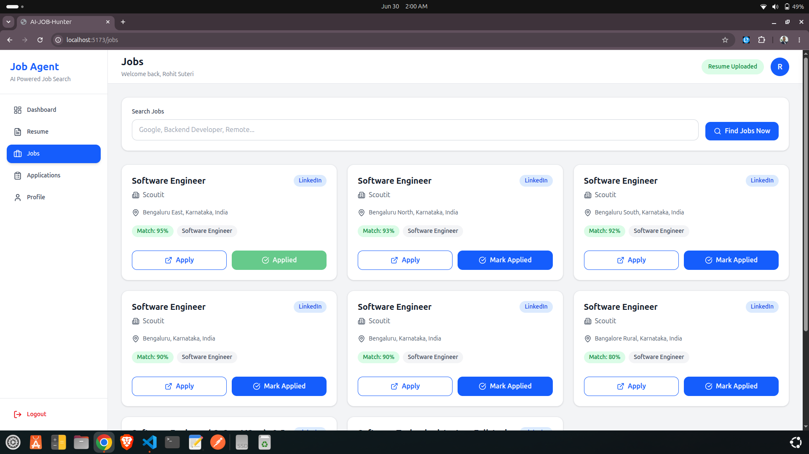
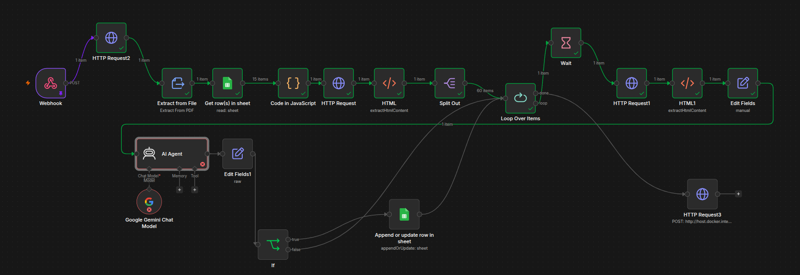

# AI Job Search Platform

A full-stack job search application that supports user authentication, resume uploads, job discovery, application tracking, profile management, and AI-enhanced resume and skills analysis.

## Project Overview

The repository is organized into a decoupled frontend, backend, and automation workflows:

- `frontend/` — React 19 + Vite client application
- `backend/` — Node.js + Express API with MongoDB persistence
- `n8n/` — workflow automation and Docker Compose configuration

## Key Features

- User registration and login with JWT-protected routes
- Job search, browsing, and application workflow
- Resume upload and Cloudinary storage
- User profile management and resume status tracking
- Application history tracking and application status cards
- AI-powered resume analysis and skills extraction
- Google Sheets integration for external data sync
- Webhook-triggered automation and job sync workflows
- n8n automation support for workflow orchestration

## Frontend Features

- Login and registration pages
- Protected dashboard, profile, resume, jobs, and applications pages
- Resume upload and management UI
- Job list, search bar, and application card components
- Application status dashboard and interview preparation cards
- Responsive design with reusable shared components
- Redux Toolkit state management

## Backend Features

- Authentication and authorization endpoints
- REST APIs for users, resumes, jobs, and applications
- JWT middleware for protected routes
- Resume uploads handled by Multer
- Cloudinary integration for resume storage
- AI-assisted skills analysis and resume parsing services
- Google Sheets and webhook service integrations
- MongoDB + Mongoose data models
- External service orchestration via webhook workflows

## Project Structure

```text
ai-job-search/
├── backend/           # Express API implementation and services
│   ├── src/
│   │   ├── app.js
│   │   ├── server.js
│   │   ├── controllers/
│   │   ├── middlewares/
│   │   ├── models/
│   │   ├── routes/
│   │   └── services/
│   ├── package.json
│   └── service-account.json
├── frontend/          # React + Vite client application
│   ├── src/
│   │   ├── App.css
│   │   ├── App.jsx
│   │   ├── index.css
│   │   ├── main.jsx
│   │   ├── components/
│   │   ├── pages/
│   │   ├── redux/
│   │   └── services/
│   ├── package.json
│   ├── eslint.config.js
│   └── vite.config.js
└── n8n/               # n8n workflow automation setup
    ├── docker-compose.yml
    ├── My workflow.json
    └── n8n_data/
```

## Setup Guide

### 1. Install dependencies

Backend:

```bash
cd backend
npm install
```

Frontend:

```bash
cd frontend
npm install
```

### 2. Configure environment variables

Create a `.env` file inside `backend/` with values such as:

```env
PORT=8000
MONGODB_URI=<your-mongodb-connection-string>
JWT_SECRET=<your-secret-key>
FRONTEND_URL=http://localhost:5173
CLOUDINARY_CLOUD_NAME=<your-cloud-name>
CLOUDINARY_API_KEY=<your-api-key>
CLOUDINARY_API_SECRET=<your-api-secret>
N8N_WEBHOOK_URL=<your-webhook-url>
```

### 3. Run the backend

```bash
cd backend
npm run dev
```

### 4. Run the frontend

```bash
cd frontend
npm run dev
```

Open the app at:

```text
http://localhost:5173
```

## Available Scripts

### Backend

- `npm run dev` — start the API with nodemon
- `npm start` — start the API in production mode

### Frontend

- `npm run dev` — start the Vite development server
- `npm run build` — build the production application
- `npm run preview` — preview the production build locally
- `npm run lint` — run ESLint on the frontend source

## Notes

- The frontend expects the backend API to be available for auth, jobs, applications, and resume uploads.
- Resume files are uploaded through the backend to Cloudinary.
- The backend includes AI and automation services for skills analysis and workflow orchestration.
- The `n8n/` folder contains workflow automation assets and Docker Compose setup to run n8n locally.


## Dashboard



## n8n Workflow

